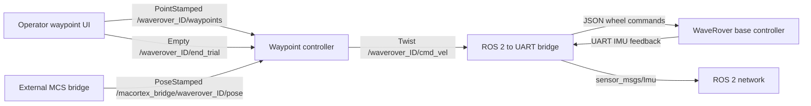
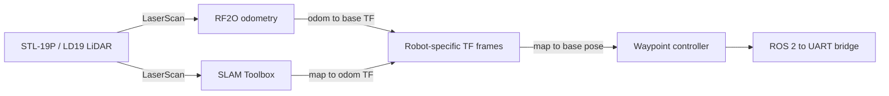

# WaveRover SIJ ROS 2 stack

This repository contains the ROS 2 software used by the EPFL WaveRover fleet.
It provides a namespaced onboard stack for six Waveshare WaveRovers, a UART
bridge to the rover controller, LiDAR-based odometry and SLAM, waypoint
following from either SLAM or an external motion-capture system (MCS), an
operator-side terminal waypoint sender, and safe boot-time Git updates.

The deployed target is a Raspberry Pi running Ubuntu 24.04 and ROS 2 Jazzy.
Each rover uses the same Git branch and shared configuration. The only
machine-specific value is its ignored local identity file.

## Contents

- [Architecture](#architecture)
- [Runtime profiles](#runtime-profiles)
- [Repository layout](#repository-layout)
- [Package guide](#package-guide)
- [Configuration and robot identity](#configuration-and-robot-identity)
- [Namespaces, topics, and frames](#namespaces-topics-and-frames)
- [Control and waypoint behavior](#control-and-waypoint-behavior)
- [Installation and build](#installation-and-build)
- [Running the stack](#running-the-stack)
- [Automatic boot-time updates](#automatic-boot-time-updates)
- [Testing and CI](#testing-and-ci)
- [Troubleshooting](#troubleshooting)
- [Operational limitations](#operational-limitations)

## Architecture

The normal MCS deployment separates the operator computer from the software
running on each rover.



When `pose_source=SLAM`, the rover additionally runs its LiDAR, RF2O laser
odometry, SLAM Toolbox, static LiDAR transform, and optionally Foxglove Bridge.



All robot-local nodes and regular topics are placed under
`/waverover_<ID>`. The `/tf` and `/tf_static` topics remain global, but every
frame ID is prefixed with the robot namespace to prevent collisions.

## Runtime profiles

The unified entry point is:

```bash
ros2 launch waverover robot.launch.py
```

It selects components from two independent settings.

### Pose source

| `pose_source` | Onboard components | Pose consumed by controller | Global waypoint frame |
| --- | --- | --- | --- |
| `MCS` | UART bridge and waypoint controller | External `PoseStamped` | `robotics_lab` by default |
| `SLAM` | LiDAR, static TF, RF2O, SLAM Toolbox, UART bridge, waypoint controller, optional Foxglove | TF lookup from robot map to base | `waverover_<ID>/map` |

The MCS-to-ROS bridge is external to this repository's onboard launch. It must
publish the expected `geometry_msgs/msg/PoseStamped` stream separately.

### Control mode

| `control_mode` | Command source and behavior | Waypoint controller |
| --- | --- | --- |
| `fixed_wing` | Discrete straight, bank-left, bank-right, and explicit-stop mapping | Started |
| `twist` | Differential-drive mapping from linear and angular velocity | Started |
| `manual_lr` | Direct left/right wheel commands with a timeout | Not started |

The shared defaults currently select `pose_source=MCS` and
`control_mode=fixed_wing`.

## Repository layout

```text
.
├── ldlidar_stl_ros2/           Vendored LDROBOT LiDAR driver
│   ├── ldlidar_driver/         Upstream serial/data-processing implementation
│   ├── src/                    ROS 2 LiDAR node
│   ├── include/                Driver and node headers
│   └── launch/                 Upstream LiDAR launch files
│
├── rf2o_laser_odometry/        Range-flow laser odometry
│   ├── src/                    RF2O algorithm and ROS 2 node
│   ├── include/                RF2O headers
│   └── launch/                 Namespaced RF2O launch
│
├── ros2waverover/              C++ ROS 2 to WaveRover UART bridge
│   ├── src/source/             Bridge, controller, UART, and main sources
│   ├── src/include/            C++ headers and WaveRover command IDs
│   ├── launch/                 Namespaced bridge launch
│   ├── scripts/                Manual left/right terminal UI
│   └── test/                   Bridge tests and lint configuration
│
├── waverover/                  Central configuration and unified launch package
│   ├── config/                 Shared defaults and identity example
│   ├── launch/                 Unified robot and SLAM launch files
│   ├── waverover/              Configuration helpers and teleop wrappers
│   └── test/                   Configuration and launch-selection tests
│
├── waverover_controller/       FIFO waypoint controller
│   ├── config/                 Optional controller-only overrides
│   ├── launch/                 Controller launch integration
│   ├── waverover_controller/   Controller and pose-provider implementation
│   └── test/                   Controller, MCS, and configuration tests
│
├── waverover_waypoint_ui/      Operator-side terminal waypoint sender
│   ├── launch/                 Interactive terminal launch
│   ├── waverover_waypoint_ui/  Parsing, publishers, and terminal application
│   └── test/                   UI helper and launch tests
│
├── deployment/                 Boot-time updater and systemd integration
│   ├── install.sh              Root-only deployment-file installer
│   ├── update_and_build.sh     Safe fetch, fast-forward, build, and rollback
│   ├── waverover-update.service
│   ├── waverover.service.d/    Drop-in ordering update before rover startup
│   └── test/                   Isolated updater transaction tests
│
└── .github/workflows/          ROS 2 Jazzy build and test workflow
```

ROS-generated `build/`, `install/`, and `log/` directories live in the
workspace root and are intentionally ignored by Git.

## Package guide

### `waverover`

This is the orchestration package and the best starting point for understanding
the stack.

- `launch/robot.launch.py` is the unified onboard entry point. It validates the
  requested pose source and control mode, then includes the appropriate lower
  level launch files.
- `launch/slam.launch.py` constructs the complete LiDAR and SLAM pipeline. It
  starts and activates the SLAM Toolbox lifecycle node explicitly.
- `config/robot_defaults.yaml` is the canonical shared configuration for all
  rovers.
- `waverover/stack_config.py` loads and validates configuration, derives robot
  namespaces, topics, MCS topics, and TF frame IDs, and rejects inconsistent
  configuration.
- `waverover/namespaced_teleop.py` wraps `teleop_twist_keyboard` in the selected
  robot namespace.
- `waverover/namespaced_manual_lr.py` launches the direct wheel calibration UI
  with central tuning values and the selected robot namespace.

### `ros2waverover`

This package is the hardware boundary between ROS 2 and the Waveshare base.
It is implemented in C++17 with Qt Core and Qt SerialPort.

- `main.cpp` starts a Qt event loop and creates `RobotController`.
- `RobotController.cpp` loads ROS parameters, selects the control mode,
  translates incoming commands into WaveRover JSON, configures firmware
  feedback, parses IMU frames, and enforces the manual-command timeout.
- `ROS2Subscriber.cpp` owns the ROS 2 subscriptions and raw IMU publisher.
- `UARTSerialPort.cpp` opens the serial device, serializes writes, buffers
  newline-delimited responses, and attempts to reopen a closed port.
- `RoverCommands.hpp` defines the relevant WaveRover command identifiers:
  emergency stop `T=0`, wheel-speed input `T=1`, feedback enable `T=131`, and
  feedback interval `T=142`.

Wheel commands are sent as newline-terminated JSON:

```json
{"T": 1, "L": 0.22, "R": 0.22}
```

Base feedback frames with `T=1001` and numeric `ax`, `ay`, `az`, `gx`, `gy`,
and `gz` fields are converted into `sensor_msgs/msg/Imu`. Orientation is marked
as unavailable through `orientation_covariance[0] = -1`.

### `waverover_controller`

The controller accepts `geometry_msgs/msg/PointStamped` messages and appends
them to an in-memory FIFO queue. Navigation logic is shared between two pose
providers:

- `SlamTfPoseProvider` reads the current 2D pose from the global TF tree.
- `McsPoseProvider` subscribes to the external MCS `PoseStamped` topic.

MCS messages are rejected when their frame is wrong, a field is non-finite, or
the quaternion has zero length. Pose freshness uses local monotonic receipt
time, so synchronized wall clocks are not required. If the pose is missing or
stale, the controller publishes the explicit safe-stop command while retaining
the waypoint queue. It resumes automatically when a valid pose returns.

Waypoints with the wrong frame or non-finite coordinates are rejected. Since
the operator UI refreshes targets, the controller suppresses a consecutive
coordinate duplicate while an equivalent target is still last in the FIFO.
Once the queue is empty, the same coordinate is accepted again so a rover that
has drifted away can resume navigation. The queue is not persisted across
process restarts.

### `waverover_waypoint_ui`

This package is intended primarily for the operator computer. It loads shared
topic and frame conventions but deliberately does not load a rover-local
identity file.

The user selects a target rover explicitly. After a rover receives a waypoint,
the UI remembers that rover's newest target and republishes it at 1 Hz by
default with a fresh timestamp and the correct per-rover frame. Targets for
different rovers are refreshed independently. The UI caches reliable waypoint
and end-trial publishers for each commanded rover. It opens the controlling
terminal directly, which keeps it interactive under a local shell, VS Code
terminal, or SSH session without a graphical display.

### `ldlidar_stl_ros2`

This is the vendored LDROBOT ROS 2 driver used for the STL-19P/LD19-compatible
LiDAR. The unified SLAM launch configures the product as `LDLiDAR_LD19`, reads
the serial stream from `/dev/ttyUSB0` at 230400 baud, and publishes the
robot-namespaced scan.

### `rf2o_laser_odometry`

RF2O estimates planar motion from consecutive 2D laser scans without wheel
encoders. In this repository its launch and node parameters are integrated with
the central namespace, topics, and frame helpers.

## Configuration and robot identity

### Shared configuration

Edit shared fleet settings in:

```text
waverover/config/robot_defaults.yaml
```

This file contains:

- namespace, node, topic, and frame conventions
- UART and IMU settings
- LiDAR geometry and serial settings
- RF2O and SLAM tuning
- MCS topic pattern, frame, QoS, and timeout
- waypoint-controller gains and tolerances
- manual wheel UI tuning
- waypoint UI and Foxglove settings

Changes to this file affect every rover after the next successful update and
build.

### Per-rover identity

Each rover must have this local file:

```text
waverover/config/robot_identity.yaml
```

It must contain exactly one key:

```yaml
robot_name: "131"
```

The file is ignored by Git and must never be committed. Create it from the
tracked example:

```bash
cp waverover/config/robot_identity.example.yaml \
   waverover/config/robot_identity.yaml
```

Then replace `CHANGE_ME` with the numeric rover ID. The supported identity
syntax is letters, digits, and underscores. The software uses the value as an
ID and adds the configured `waverover_` prefix itself.

The identity path can be selected explicitly:

```bash
export WAVEROVER_IDENTITY_FILE=/home/waverover/ros2_ws/src/waverover/config/robot_identity.yaml
```

On deployed robots the systemd drop-in exports this path automatically.

Configuration loading fails deliberately if the identity is missing, invalid,
tracked by Git during deployment, or mixed back into the shared defaults.

## Namespaces, topics, and frames

For `robot_name: "132"`, the derived namespace is `waverover_132`.

### Main topics

| Purpose | Type | Pattern |
| --- | --- | --- |
| Velocity command | `geometry_msgs/msg/Twist` | `/waverover_<ID>/cmd_vel` |
| Waypoint input | `geometry_msgs/msg/PointStamped` | `/waverover_<ID>/waypoints` |
| End-trial signal | `std_msgs/msg/Empty` | `/waverover_<ID>/end_trial` |
| Raw IMU | `sensor_msgs/msg/Imu` | `/waverover_<ID>/imu/data_raw` |
| Laser scan | `sensor_msgs/msg/LaserScan` | `/waverover_<ID>/scan` |
| RF2O odometry | `nav_msgs/msg/Odometry` | `/waverover_<ID>/odom_rf2o` |
| Direct wheel calibration | `std_msgs/msg/Float32MultiArray` | `/waverover_<ID>/manual_lr` |
| Map | `nav_msgs/msg/OccupancyGrid` | `/waverover_<ID>/map` |
| MCS pose input | `geometry_msgs/msg/PoseStamped` | `/macortex_bridge/waverover_<ID>/pose` |
| Transforms | TF messages | `/tf`, `/tf_static` |

Robot-local topic basenames remain relative in the central YAML so the ROS
namespace applies consistently. The configuration validator rejects accidental
absolute names for these topics.

### TF frames

For robot 132, the SLAM frames are:

```text
waverover_132/map
└── waverover_132/odom
    └── waverover_132/base_footprint
        └── waverover_132/laser
```

MCS mode does not create this SLAM TF chain. Its controller consumes poses in
the configured external frame, normally `robotics_lab`.

## Control and waypoint behavior

### Twist mode

The bridge converts a `Twist` into differential wheel commands:

```text
left  = linear.x - angular.z
right = linear.x + angular.z
```

Inputs are limited to `[-1, 1]` and final wheel commands to `[-0.5, 0.5]`.
The waypoint controller first turns in place until the heading error is within
the configured tolerance, then commands forward motion. It stops after the
final waypoint.

### Fixed-wing mode

Fixed-wing mode approximates a vehicle that should normally keep moving:

- straight: both wheels forward
- bank left: inner wheel reverse/slow, outer wheel forward
- bank right: mirrored wheel command
- final waypoint: continue banking in a persistent loiter direction
- new waypoint during loiter: leave loiter and resume queue tracking

The current bridge constants in `RobotController.cpp` are:

| Command | Left | Right |
| --- | ---: | ---: |
| Straight | `0.22` | `0.22` |
| Bank left | `-0.10` | `0.48` |
| Bank right | `0.48` | `-0.10` |
| Explicit stop | `0.00` | `0.00` |

A normal all-zero `Twist` means straight motion in fixed-wing mode. To avoid
ambiguity, the controller requests an explicit fixed-wing stop by publishing a
`Twist` whose only non-zero field is `angular.x = 1.0`. This marker is used
while waiting for the first waypoint, when pose data is unavailable, and after
an end-trial signal. End-trial clears the FIFO and loiter state, latches this
safe stop on every controller cycle, and therefore cannot enter final loiter.
An ordinary all-zero `Twist` keeps its existing fixed-wing meaning. A later
valid waypoint clears the latch and begins a new trial.

### Manual left/right mode

Manual mode accepts `[left, right]` on the `manual_lr` topic, clamps both values
to `[-0.5, 0.5]`, starts from zero, and returns to zero when commands stop for
longer than `manual_lr_timeout_sec`.

Start the unified stack in calibration mode:

```bash
ros2 launch waverover robot.launch.py control_mode:=manual_lr
```

In another robot-local terminal:

```bash
ros2 run waverover waverover_manual_lr
```

### Waypoint controller defaults

Current central defaults include:

| Parameter | Default |
| --- | ---: |
| Control rate | `10 Hz` |
| Goal tolerance | `0.15 m` |
| Heading tolerance | `15 deg` |
| Forward `linear.x` | `0.25` |
| Turn/bank `angular.z` | `0.40` |
| MCS pose timeout | `0.50 s` |
| Final loiter direction | `left` |

These are semantic controller commands. Fixed-wing wheel values are chosen by
the C++ bridge's discrete mapping.

Controller-only tuning can be supplied through
`waverover_controller/config/waypoints.yaml` and the `params_file` launch
argument. Robot identity, pose source, topics, frames, and MCS settings remain
central or explicit launch arguments.

## Installation and build

### Requirements

- Ubuntu 24.04
- ROS 2 Jazzy
- Python 3 and PyYAML
- Colcon and rosdep
- Qt 5 Core and SerialPort development packages
- ROS dependencies declared in each `package.xml`

Install the non-ROS bridge dependencies if they are not already present:

```bash
sudo apt update
sudo apt install -y \
  cmake \
  qtbase5-dev \
  qt5-qmake \
  libqt5serialport5-dev
```

### Clone into the ROS workspace

The repository itself is the workspace's `src` directory:

```bash
mkdir -p /home/waverover/ros2_ws
git clone https://github.com/Yacine-Derder/Waverover-SIJ.git \
  /home/waverover/ros2_ws/src
```

Do not clone the repository as another directory inside an existing `src`.
Do not retain package backups anywhere below `/home/waverover/ros2_ws`, because
Colcon will recursively discover duplicate package names.

Create the local identity before launching onboard code.

### Install declared ROS dependencies

```bash
cd /home/waverover/ros2_ws
source /opt/ros/jazzy/setup.bash

sudo rosdep init  # only needed once per machine
rosdep update
rosdep install \
  --from-paths src \
  --ignore-src \
  --rosdistro jazzy \
  -r -y \
  --skip-keys ament_python
```

### Build

```bash
cd /home/waverover/ros2_ws
source /opt/ros/jazzy/setup.bash
colcon build --symlink-install
source install/setup.bash
```

The overlay must be sourced in every new shell before using these packages.

## Running the stack

### Rover: default MCS and fixed-wing profile

```bash
source /opt/ros/jazzy/setup.bash
source /home/waverover/ros2_ws/install/setup.bash
export WAVEROVER_IDENTITY_FILE=/home/waverover/ros2_ws/src/waverover/config/robot_identity.yaml

ros2 launch waverover robot.launch.py
```

### Rover: SLAM profile

```bash
ros2 launch waverover robot.launch.py \
  pose_source:=SLAM \
  control_mode:=twist
```

### Inspect launch arguments

```bash
ros2 launch waverover robot.launch.py --show-args
```

Launch arguments temporarily override central defaults. They do not edit the
YAML files.

### Operator computer: waypoint UI

The operator machine normally builds or installs at least `waverover` and
`waverover_waypoint_ui`, then runs:

```bash
ros2 launch waverover_waypoint_ui waypoint_ui.launch.py \
  robot_name:=132 \
  pose_source:=MCS
```

Interactive commands are:

```text
1.0 2.0          send (1.0, 2.0) to the selected robot
133 1.0 2.0      select robot 133 and send the waypoint
robot 134        change target without sending
status           show destination, refreshed targets, commanded rovers, and recent sends
end              stop refreshes and signal end-trial to all commanded rovers
end trial        alias for end
help             show command help
quit             exit
```

The UI frame must match the target controller's pose source. MCS waypoints use
`robotics_lab` by default. SLAM waypoints use `waverover_<ID>/map`.

Each rover's latest target is refreshed independently at
`waypoint_ui.refresh_rate_hz` (1 Hz by default). This lets the controller
re-accept a final target after its FIFO became empty and correct physical drift
without wheel encoders. Consecutive duplicate suppression is necessary so the
same refresh stream does not grow the FIFO while a target is still queued.

`end` first stops all refresh timers, then publishes reliable `Empty` messages
on `/waverover_<ID>/end_trial` for every rover that actually received a
waypoint during the UI session. Merely selecting a rover does not include it.
The same cleanup runs on `quit`, terminal EOF, Ctrl-C, and SIGTERM, and briefly
drains ROS before publishers are destroyed. Sending another valid waypoint
afterward restarts refreshes and begins a new trial on that rover.

### Publish a waypoint without the UI

MCS example:

```bash
ros2 topic pub --once /waverover_132/waypoints \
  geometry_msgs/msg/PointStamped \
  "{header: {frame_id: robotics_lab}, point: {x: 1.0, y: 2.0, z: 0.0}}"
```

## Automatic boot-time updates

The `deployment/` directory adds a one-shot update step before the existing
`waverover.service`. It does not provide or replace the base rover service.

The updater:

1. runs as the unprivileged `waverover` user
2. acquires a lock to prevent concurrent updates
3. verifies the repository root and expected GitHub remote
4. verifies that the identity exists, is valid, is ignored, and is untracked
5. refuses dirty trees, detached HEADs, wrong branches, rewinds, and divergence
6. fetches `origin/main` with a timeout
7. accepts only a verified fast-forward
8. builds with `colcon build --symlink-install`
9. rolls back to the previous commit and rebuilds if the new build fails
10. allows the existing software to start when the network is unavailable

If the repository is already current and `install/setup.bash` exists, the
build is skipped.

### Install deployment integration

Review the scripts, then run:

```bash
cd /home/waverover/ros2_ws/src
bash -n deployment/update_and_build.sh deployment/install.sh
sudo ./deployment/install.sh
```

The installer copies the updater to `/usr/local/lib/waverover`, installs the
one-shot unit and the `waverover.service` drop-in, and reloads systemd. It does
not start or stop either service.

Test while the rover is physically safe and its runtime service is stopped:

```bash
sudo systemctl stop waverover.service
sudo systemctl start waverover-update.service
sudo journalctl -u waverover-update.service -n 200 --no-pager
sudo systemctl start waverover.service
```

At rest, a successful `Type=oneshot` updater appears as `inactive (dead)` with
`status=0/SUCCESS`. That is normal.

Deployment files are copied to root-owned locations. If a future commit changes
`deployment/update_and_build.sh`, `deployment/waverover-update.service`, or the
systemd drop-in, rerun `sudo ./deployment/install.sh` on each rover. Updating
the Git checkout alone does not replace those installed copies.

See [`deployment/README.md`](deployment/README.md) for the full migration,
rollback, logging, and removal procedure.

## Testing and CI

GitHub Actions runs on Ubuntu 24.04 with ROS 2 Jazzy. It installs declared
dependencies, builds the entire workspace, runs ROS package tests, and runs the
updater transaction tests separately. The vendored LDROBOT driver's upstream
lint-only test target is skipped, but the driver is still built.

### Local build and ROS tests

```bash
cd /home/waverover/ros2_ws
source /opt/ros/jazzy/setup.bash
colcon build --symlink-install --event-handlers console_direct+
source install/setup.bash

colcon test \
  --packages-skip ldlidar_stl_ros2 \
  --event-handlers console_direct+
colcon test-result --verbose
```

### Isolated updater tests

```bash
cd /home/waverover/ros2_ws/src
bash -n deployment/update_and_build.sh deployment/install.sh
python3 -m pytest -v deployment/test/test_update_and_build.py
git diff --check
```

The updater tests use temporary fake repositories and builds. They do not
update the live rover workspace.

## Reliability behavior

The external MCS pose stream is approximately 60 Hz and the onboard waypoint
loop defaults to 30 Hz, so control does not run ahead of fresh measurements.
The 0.05 m goal tolerance remains intentional. After an exact token/frame/point
acknowledgement, another same-epoch destination within 0.05 m continues loiter
without a new token while measured drift remains within 0.30 m.

An active token with less than 0.03 m progress for 3 seconds enters a bounded
0.75 second straight escape. Three unsuccessful attempts produce an exact,
token-preserving `waypoint_failed`, not a false reached acknowledgement.

Real dispatch uses 0.30 m best-effort separation. Every algorithm shares one
deterministic geofence-aware repair stage. Collision observations are recorded
but cannot send `end_trial`; malformed, stale, non-finite, frame-invalid, and
geofence-invalid data still fail closed. Target priority switches every 20
seconds by default.

All UART access runs in the owning Qt thread. Velocity writes are coalesced,
configuration writes stay ordered, and bounded reopen exhaustion exits the
bridge so rate-limited systemd recovery can restart the stack. The watchdog
uses local `cmd_vel` and enabled-IMU freshness; MCS age and waypoint publisher
count are informational, and waiting/loiter/trial-ended/manual states are not
restart predicates.

```bash
ros2 topic echo /waverover_<id>/health
ros2 topic echo /waverover_<id>/serial_health
systemctl show waverover.service -p NRestarts -p Result
journalctl -u waverover.service -b -n 200 --no-pager
```

## Troubleshooting

### `Package 'waverover' not found`

Build and source both ROS layers:

```bash
cd /home/waverover/ros2_ws
source /opt/ros/jazzy/setup.bash
colcon build --symlink-install
source install/setup.bash
```

### Duplicate package names during `colcon build`

There is another source copy inside the workspace. Move backups completely
outside `/home/waverover/ros2_ws` and rebuild. A directory such as
`/home/waverover/ros2_ws/src.before-git` is still inside the workspace and will
be discovered by Colcon.

### Identity appears in `git status`

Verify the exact path and ignore rule:

```bash
cd /home/waverover/ros2_ws/src
git check-ignore -v waverover/config/robot_identity.yaml
git ls-files --error-unmatch waverover/config/robot_identity.yaml
```

The first command must succeed. The second must fail because the identity must
not be tracked.

### Automatic updater refuses to run

```bash
cd /home/waverover/ros2_ws/src
git status --short
git branch --show-current
git remote -v
sudo journalctl -u waverover-update.service -n 200 --no-pager
```

The deployment checkout must be a clean `main` branch with the expected remote.

### UART permission or lock failure

The runtime service should run as `waverover`, include the `dialout` group, and
have exclusive access to `/dev/ttyAMA0`. Check:

```bash
id waverover
ls -l /dev/ttyAMA0
sudo systemctl cat waverover.service
sudo journalctl -u waverover.service -b --no-pager
```

Do not run a second bridge process while the service owns the serial port.

### MCS controller remains stopped

Confirm that the external bridge is publishing the correct topic and frame:

```bash
ros2 topic echo /macortex_bridge/waverover_132/pose --once
```

The default expected `frame_id` is `robotics_lab`. The controller also stops if
no valid message is received within the configured 0.5-second timeout.

### Seeing nodes from other robots

This is expected when all machines share the same ROS domain and subnet. Use
namespaces to distinguish them:

```bash
ros2 node list | grep waverover_
ros2 topic list | grep waverover_132
```

## Operational limitations

- The updater checks at boot or service startup. It does not poll Git
  continuously.
- The updater does not install new system or rosdep dependencies. Dependency
  changes require manual provisioning before deployment.
- MCS pose production is external to the onboard stack.
- Waypoint queues and UI history are in memory and disappear on restart.
- Fixed-wing control is a discrete wheel mapping, not a dynamic vehicle model
  or optimized trajectory controller.
- RF2O is LiDAR-only odometry. This repository does not currently fuse it with
  the IMU through an EKF.
- Starting Foxglove is part of the SLAM launch path. The default MCS-only path
  does not start it through `robot.launch.py`.
- The repository contains vendored upstream packages with their own licenses,
  while several project-owned `package.xml` files still contain placeholder
  license declarations. Resolve those declarations before external release.

## Safety

These robots can move as soon as the bridge and controller start. Keep the
platform lifted or otherwise physically restrained during first builds,
identity changes, control-mode changes, updater tests, and service validation.
Verify the selected robot ID, pose source, command topic, and serial device
before placing a rover on the ground.
